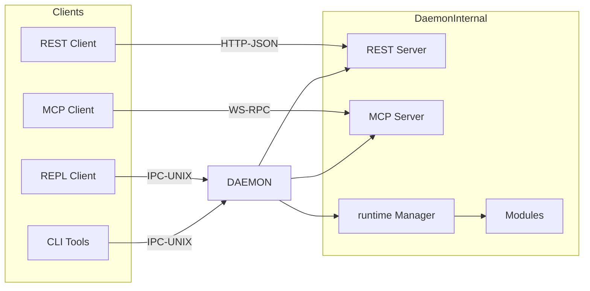
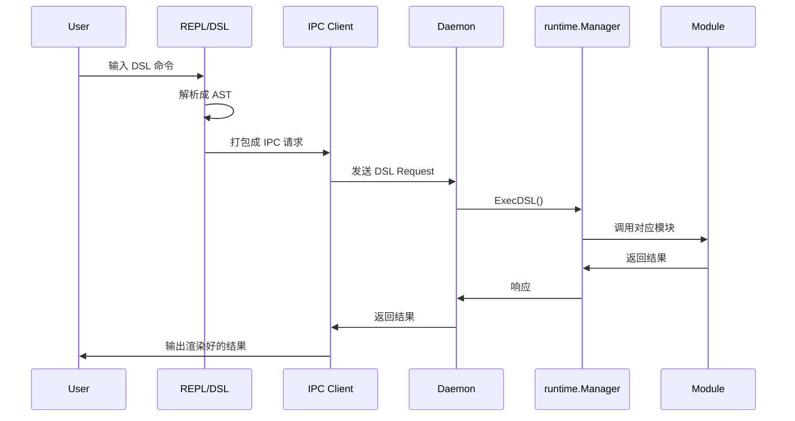
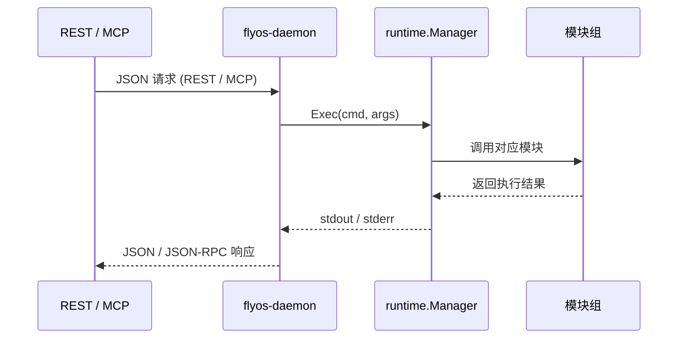
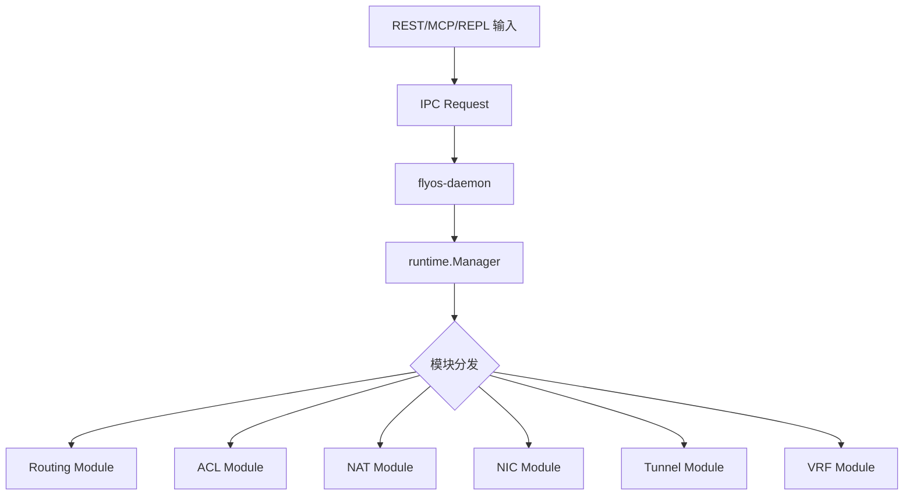
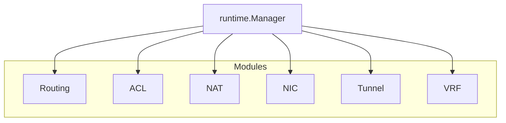

# 🛰️ FlyOS

**FlyOS** 是一款集网络与安全能力于一身的轻量级操作系统，支持多种控制通道（REPL / REST / MCP），通过 **IPC** 与守护进程通信，实现对网络与安全模块（routing / nic / acl / tunnel / nmap 等）的统一调度。

其核心目标是在通用设备上，为 **路由、交换、防火墙、VPN、数据面加速及边缘计算** 提供 **统一、可编程、可扩展的运行环境**。

### 控制通道

- **REPL（DSL）**：面向运维人员的交互式命令行
- **REST API**：适合 UI、自动化平台和 DevOps/NetOps 集成
- **MCP（JSON-RPC）**：面向 AI/LLM 自动化管理与智能编排

无论使用哪种控制方式，所有指令最终都通过 **IPC (Unix Socket)** 调用守护进程，由 **runtime.Manager** 调度模块执行，实现网络与安全策略的统一管理与高效扩展。

---

# 📦 核心特性

- 多控制通道：REPL（DSL）、REST API、MCP（JSON-RPC）
- IPC 通信（Unix Socket）实现统一调度
- 模块化网络与安全功能：routing、ACL、NAT、NIC、Tunnel、VRF 等
- runtime.Manager 统一调度模块
- DSL 支持声明式配置
- 面向自动化与 AI 管理

---

# 🏗️ 项目结构
```
flyos/
├── cmd/
│   ├── repl/
│   ├── client/
│   └── daemon/
├── pkg/
│   ├── dsl/
│   ├── runtime/
│   ├── module/
│   ├── ipc/
├── modules/
│   ├── routing/
│   ├── acl/
│   ├── nat/
│   ├── nic/
│   ├── tunnel/
│   └── vrf/
```
---

# 🧠 总体架构图


---

# 🔧 安装说明

## 1. 克隆仓库

```bash
git clone https://github.com/flystary/flyos.git
cd flyos
```

## 2. 编译项目

确保 Go >= 1.20.0 环境：

```bash
go build -o flyos ./main.go
go build -o flyos-daemon ./cmd/daemon/main.go
go build -o flyos-cli ./cmd/client/main.go
go build -o flyos-repl ./cmd/repl/main.go
```

## 3. 配置

创建 `config.toml` 和 `desc.toml`，可参考示例：

```toml
[system]
hostname = "flyos-node"
```

```toml
[routes]
default = "192.168.1.1"
```

## 4. 启动守护进程

```bash
./flyos-daemon
```

---

# ⚙️ 使用示例

## 1. 使用 REPL / DSL
```bash
root@flyos:~# ssh flyos
                __                             __
 _      _____  / /________  ____ ___  ___     / /_____
| | /| / / _ \/ / ___/ __ \/ __ `__ \/ _ \   / __/ __ \
| |/ |/ /  __/ / /__/ /_/ / / / / / /  __/  / /_/ /_/ /
|__/|__/\___/_/\___/\____/_/ /_/ /_/\___/   \__/\____/

         ________      ____  _____
        / ____/ /_  __/ __ \/ ___/
       / /_  / / / / / / / /\__ \
      / __/ / / /_/ / /_/ /___/ /
     /_/   /_/\__, /\____//____/
             /____/
📄 desc.toml 已加载，共 39 条📄命令，9 个🗂分类
🔄 已加载 340 个📦外部命令
🚀 FlyOS REPL 已启动！💡 输入 help 查看命令，输入 exit 安全退出
flyos> help
🛠️  内置命令:
  env        - 打印环境变量
  exit       - 退出flyos环境
  help       - 🔍 显示命令或分类的帮助信息（支持模糊搜索）
  list       - 打印全部命令

🗂  外部命令分类:
  arp
  nic
  pop
  route
  switch
  sys
  system
  tools
  vlan

💡 使用 `help [分类名]` 查看分类内命令
flyos> exit
👋 Bye!
Connection to 127.0.0.1 closed.
```

```bash
flyos> route add static { prefix 10.0.0.0/24; via 192.168.1.1; dev eth0; track yes }
flyos> route set static { prefix 10.0.0.0/24; via 192.168.1.1; dev eth0; track yes }
flyos> route delete static { prefix 10.0.0.0/24; via 192.168.1.1; dev eth0; track yes }
flyos> route sync {
	static { prefix 10.0.0.0/24; via 192.168.1.1; dev eth0; track yes }
	bgp { prefix 172.16.0.0/16; local_pref 200; community [ 65001:100 ] }
	ospf { prefix 192.168.10.0/24; area 0.0.0.0; type external }
	pbr { prefix 10.1.0.0/16; fwmark 100; priority 1000; iif eth1 }
	static { prefix 20.0.0.0/24; via 192.168.2.1; dev eth1; track yes }
    }
flyos>

```

## 2. 使用 REST API

```bash
curl -X POST http://localhost:8080/api/v1/route/add      -H "Content-Type: application/json"      -d '{"prefix":"10.0.0.0/24","via":"192.168.1.1"}'
```

## 3. 使用 MCP（JSON-RPC）

```json
POST /mcp
{
    "jsonrpc": "2.0",
    "method": "route.add",
    "params": {
        "prefix": "10.0.0.0/24",
        "via": "192.168.1.1"
    },
    "id": 1
}
```

## 4. IPC 调用示例（Go）

```go
req := Request{
    ID:      "1",
    Command: "route add",
    Args:    []string{"prefix=10.0.0.0/24", "via=192.168.1.1"},
}
client.Send(req)
```

---

# ⚙️ REPL DSL 流程图



---

# 🔹 REST / MCP 流程图

---

# ⚙️ runtime 调用链图



---

# 🧱 模块架构图


---

# 🗒️ TODO

- [ ] REPL 登录 / ACL
- [ ] REST OpenAPI
- [ ] MCP schema 自动生成
- [ ] CLI/REPL history 与补全
- [ ] modules 生成统一文档