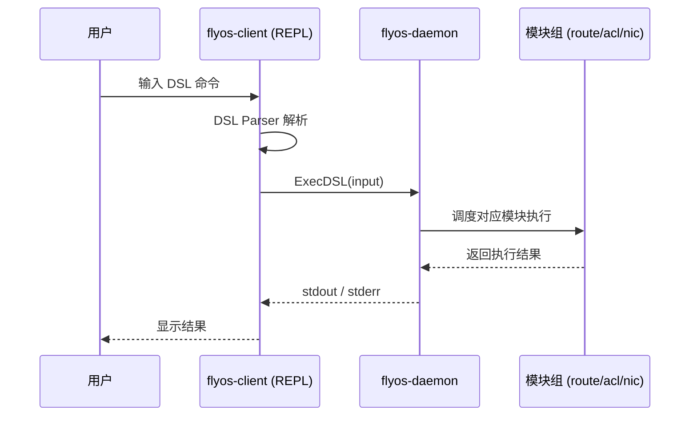
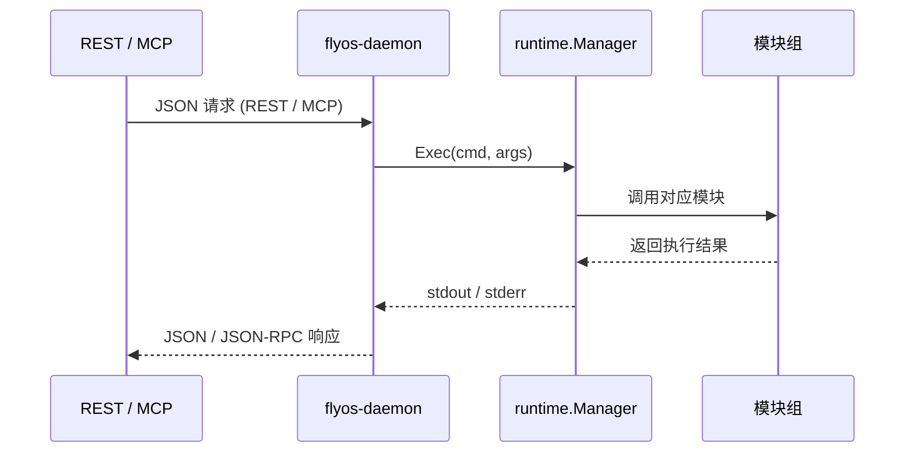
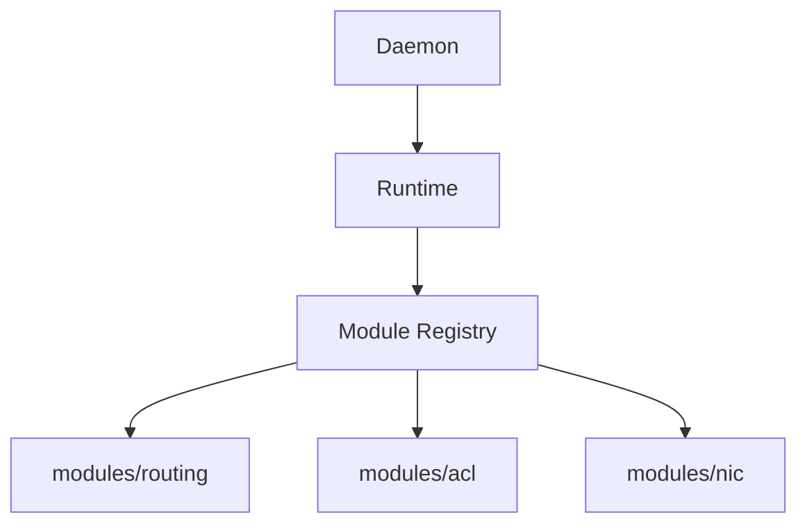
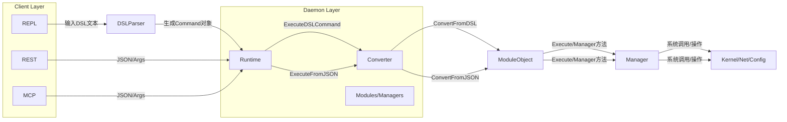
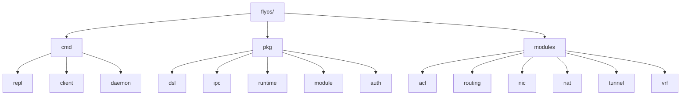

# 🛰️ FlyOS 架构设计文档

FlyOS 是一个集网络与安全的操作系统，支持多种控制通道（REPL / REST / MCP）通过 IPC 与守护进程通信，统一调度网络模块执行操作。

---

## 🔹 总体架构

```mermaid
graph LR

    %% ======================
    %% Clients Layer
    %% ======================
    subgraph Clients["Clients (外部控制入口)"]
        direction TB
        REPL[REPL 客户端 (cmd/repl, DSL)]
        CLI[CLI / Tools]
        RESTC[REST Clients]
        MCPC[MCP Clients]
    end

    %% 对接 Daemon
    REPL -->|IPC: Unix Socket| DAEMON
    CLI  -->|IPC: Unix Socket| DAEMON
    RESTC -->|HTTP/JSON| REST
    MCPC -->|WebSocket/JSON-RPC| MCP

    %% ======================
    %% Daemon 外部节点
    %% ======================
    DAEMON --> REST
    DAEMON --> MCP
    DAEMON --> Runtime

    %% ======================
    %% Daemon 内部结构
    %% ======================
    subgraph Daemon["flyos-daemon (核心执行进程)"]
        direction LR
        REST[REST Server]
        MCP[MCP Server]
        Runtime[runtime.Manager]
        Modules[modules/*]
    end

    Runtime --> Modules

    %% note
    note right of REST
        REST / MCP 在 daemon 内部监听外部请求，
        通过 runtime.Manager.Exec() 调用模块。
    end

```

说明：
- REPL 输入 DSL → ExecDSL()
- REST / MCP → Exec()
- Runtime 调度模块执行实际业务逻辑


## 🔹 REPL DSL 执行时序图



## 🔹 REST / MCP 执行时序图

## 🔹 模块注册流程


## 🔹 数据流总览

流程说明
1. DSL（REPL）
 - 用户输入 DSL 文本（如 route add static { prefix 10.0.0.0/24; via 192.168.1.1 }）。
 - DSL Parser 解析成 Command 对象。
 - Runtime 的 ExecuteDSLCommand 接收 Command 对象。
2. Runtime
 - 根据 Command.Kind 调用对应 Converter。
 - Converter 将 DSL Command 转成模块对象（如 Route/BGP/OSPF）。
 - 模块对象内部有 Execute(verb string) 方法，封装具体的 Manager 调用。
3. REST/MCP
 - 直接传 JSON/Args 给 Runtime。
 - Runtime 使用 ExecuteFromJSON。
 - Converter 将 JSON 转成模块对象。
 - 模块对象调用 Manager 执行。
4. 模块/Manager
 - 负责真正系统操作，如：
  - routing.CLIManager 调用系统命令。
  - routing.NetlinkManager 调用 netlink。
  - acl.Manager 管理防火墙规则。
 - Manager 可以复用同一套接口，实现统一调用。
5. 最终系统效果
- 所有路径（DSL、REST、MCP）都通过 Runtime + Converter + Module/Manager 执行。
- 可以统一权限检查、事件发布、日志等。

## 典型目录结构

