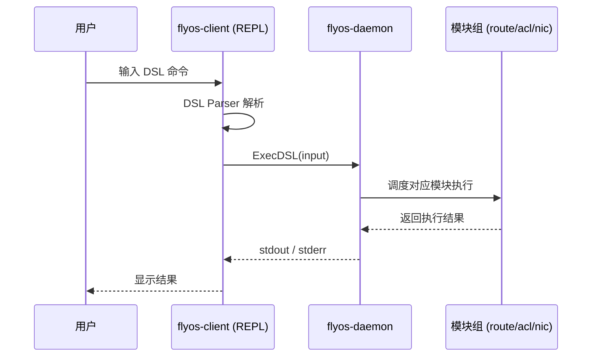
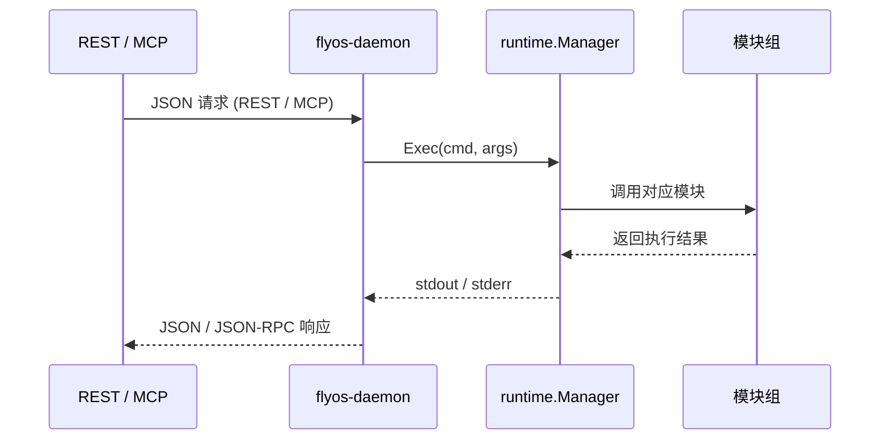
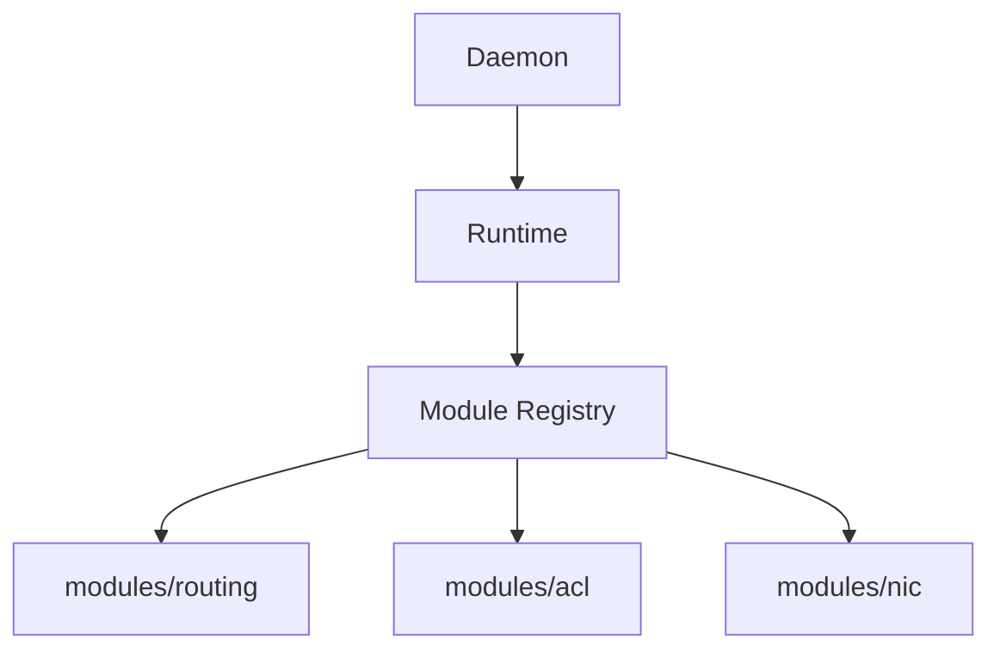
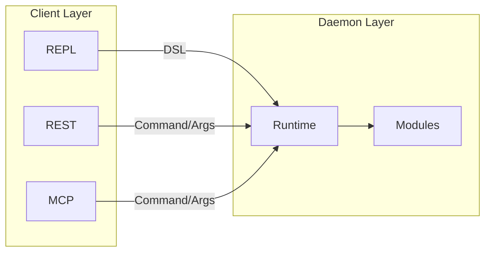
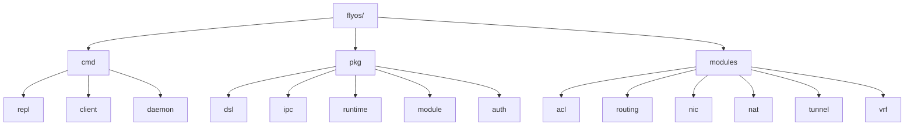

# 🛰️ FlyOS 架构设计文档

FlyOS 是一个轻量级网络操作系统，支持多种控制通道（REPL / REST / MCP）通过 IPC 与守护进程通信，统一调度网络模块执行操作。

---

## 🔹 总体架构

```mermaid
graph LR
    REPL[REPL (DSL)] -->|IPC| Daemon[flyos-daemon]
    REST[REST Server (JSON)] -->|IPC| Daemon
    MCP[MCP Server (JSON-RPC)] -->|IPC| Daemon
    Daemon --> Runtime[runtime.Manager]
    Runtime --> Modules[modules.*]
```

说明：
- REPL 输入 DSL → ExecDSL()
- REST / MCP → Exec()
- Runtime 调度模块执行实际业务逻辑


## 🔹 REPL DSL 执行时序图



## 🔹 REST / MCP 执行时序图

## 🔹 模块注册流程


## 🔹 数据流总览


## 典型目录结构


