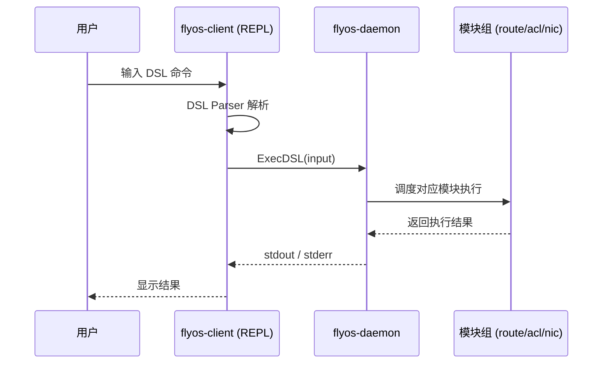
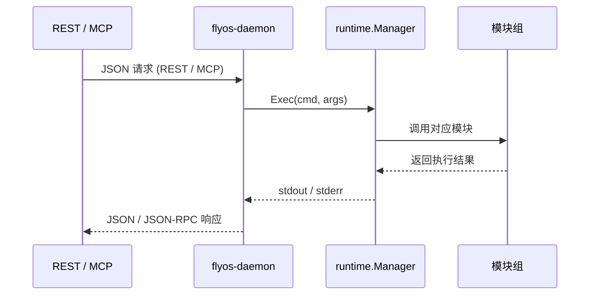
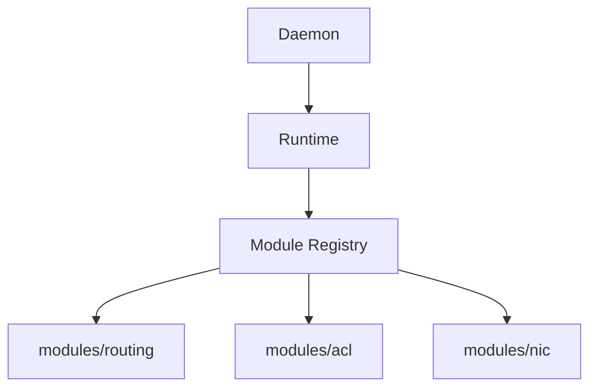
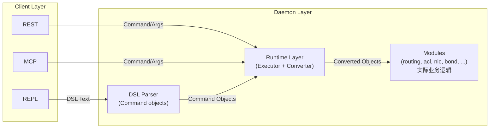
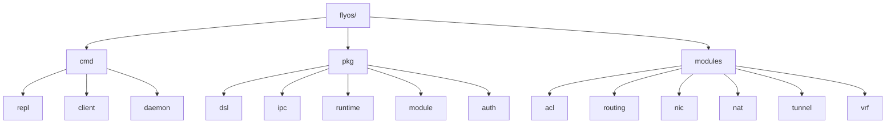

# 🛰️ FlyOS 架构设计文档

FlyOS 是一个集网络与安全的操作系统，支持多种控制通道（REPL / REST / MCP）通过 IPC 与守护进程通信，统一调度网络模块执行操作。

---

## 🔹 总体架构

```mermaid
graph LR
    subgraph Clients
      REPL[REPL 客户端 (cmd/repl)] -->|Unix Socket (IPC)| Daemon
      CLI[其它 CLI/工具] -->|Unix Socket (IPC)| Daemon
    end

    subgraph Daemon["flyos-daemon (长驻进程)"]
      Daemon --> REST[REST Server (HTTP) - 内部监听]
      Daemon --> MCP[MCP Server (WebSocket/JSON-RPC) - 内部监听]
      Daemon --> Runtime[runtime.Manager]
      Runtime --> Modules[modules.*]
    end

    note right of REST
      REST 与 MCP 在 daemon 内部监听外部请求，
      直接调用 runtime.Manager.Exec()
    end
```

说明：
- REPL 输入 DSL → ExecDSL()
- REST / MCP → Exec()
- Runtime 调度模块执行实际业务逻辑


## 🔹 REPL DSL 执行时序图



## 🔹 REST / MCP 执行时序图

## 🔹 模块注册流程


## 🔹 数据流总览

图解说明
1. Client Layer
- REPL/REST/MCP 提供不同入口
- DSL 文本只来自 REPL，REST/MCP 直接可传 Command和参数
2. Daemon Layer
- DSL Parser → 将文本解析成 Command 对象
- Runtime → 执行 Command，对象转换（Converter），调度 Manager
- Modules → 真正的系统操作（如路由、ACL、NIC、GRE、IPSec 等）
3. 数据流
- DSL 文本 → Command → Runtime → Converter → Module 对象 → 执行

## 典型目录结构

